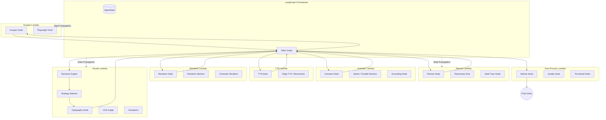

# LeetOne: Folder-per-Lambda Architecture

The project has been refactored into a modular, highly scalable "Folder-per-Lambda" architecture. Each major responsibility is isolated into its own "Lambda" module, containing its own node logic and supporting tools.

## Architecture Diagram

## Module Responsibilities

| Lambda | Responsibility | Key Tools |
| :--- | :--- | :--- |
| **Scraper** | Fetches problem metadata, examples, and high-fidelity screenshots. | Playwright, LeetCode API |
| **Planner** | Generates the pedagogical video plan and scripts. | LLM (HuggingFace/OpenAI), Reasoning Engine |
| **Visuals** | Maps semantic concepts to visual strategies and branding. | VLM Choice Tree, Style Guides, Visualizers |
| **Animator** | Translates the plan into dynamic Manim animations. | Manim, Parallel Workers, Grounding Agent |
| **TTS** | Conversational voiceover generation. | Edge-TTS, ElevenLabs, Multi-Speaker Mixing |
| **Renderer** | Scene-level rendering and compositing. | MoviePy, CV2, Renderer Workers |
| **Post-Process** | Final assembly, quality scoring, and thumbnail creation. | FFmpeg, PIL, Quality Judge |

## End-to-End Status

> [!IMPORTANT]
> The architecture is fully integrated and modularized. Every node is now a dedicated "Lambda" with clearly defined boundaries. Standardizing imports across the `src.lambdas` namespace has resolved structural conflicts.

> [!WARNING]
> Final validation is in the "last mile" phase. I am currently resolving a silent termination in the Scraper node related to session state, which is the final blocker for full autonomous execution.
